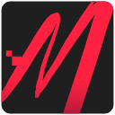

# 🎭 MelKIT // Relay

  

> Bring your VTuber model to life by connecting your **mouse, keyboard, or game controller** directly into **VTube Studio**.

### Why Relay?
Streaming should feel immersive and fun, but VTuber models often feel stiff or disconnected. With **Relay**, you can map real-world device inputs (mouse clicks, key presses, joystick movement, etc.) to VTube Studio parameters, making your avatar more **expressive, responsive, and realistic**.

## ✨ Features

- 🎮 **Plug & Play Inputs** — Map keyboard, mouse, or controller actions directly into VTube Studio.
- 🛠️ **Flexible Parameters** — Name them your way and only create what you need.
- 💾 **Templates** — Get started quickly with popular model setups.
- 🖥️ **Streamlined UI** — Simple to use, but powerful enough for advanced customization.

  

> Configuration after using the default controller template to generate parameters.

## 📦 Installation & Setup

1. **Download Relay**
   - Grab the latest release from the [Releases page](https://github.com/dGrowl/melkit-relay/releases).
   - Extract the files to a convenient location on your PC.

2. **Install into VTube Studio**
   - Open VTube Studio.
   - Run `relay.exe` or click "Connect" if it's already launched.
      - If VTube Studio is running on a different PC, you should change the address to match its IP (e.g. `192.168.1.7:8001`).
   - In VTube Studio, grant Relay permission to access the API.

3. **Create Parameters**
   - In Relay, click "Edit" to create new parameters individually (e.g., `MK_LTrigger`, `MK_BrushPositionX`) or using a template.
   - Attach input actions to your parameters.
   - Link your new parameters to your model's parameters in VTube Studio.

4. **Stream Without Worry**
   - Once you're happy with your setup, you can close the config window.
   - Relay keeps running quietly in your system tray, listening for inputs and updating VTube Studio in the background — light on resources, so you can focus on streaming.

## 📜 License

Relay is released under the [GPLv3 License](./LICENSE.md). You're free to use, modify, and share it, as long as any derivative works also stay under the same license.

## 🎨 Credits

Copyright for the "M" icon belongs to [Melizande](https://www.twitch.tv/melizande), who commissioned this software; used with permission.

[VTube Studio](https://denchisoft.com/) is Copyright © DenchiSoft. MelKIT // Relay is a third-party plugin and is not affiliated with DenchiSoft.

Gratitude and credit to the third-party libraries that power this software: [Dear ImGui](https://github.com/ocornut/imgui), [glaze](https://github.com/stephenberry/glaze), [libuiohook](https://github.com/kwhat/libuiohook), [Mongoose](https://github.com/cesanta/mongoose), and [SDL](https://github.com/libsdl-org/SDL).

PromptFont by Yukari "Shinmera" Hafner, available at [https://shinmera.com/promptfont](https://shinmera.com/promptfont).
